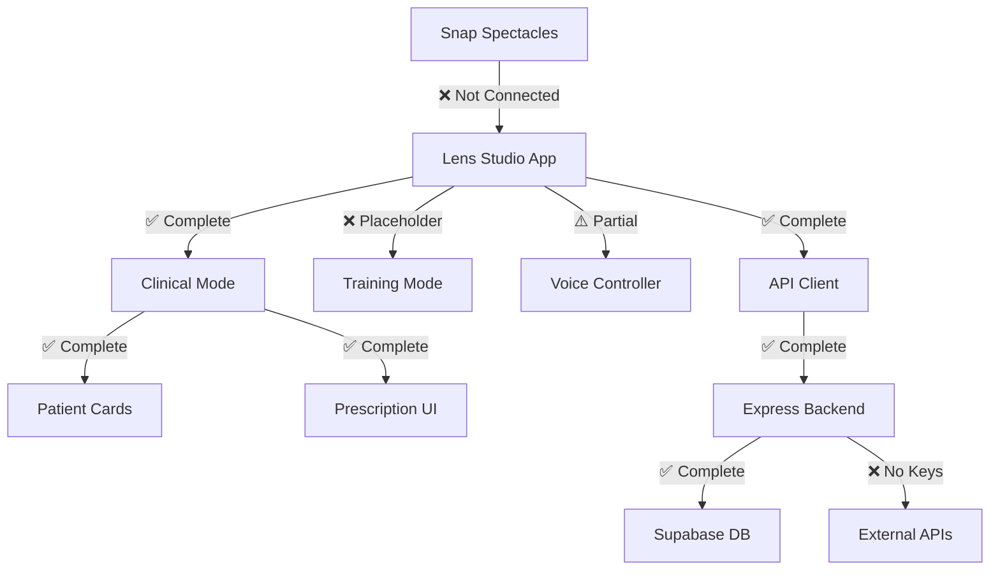

# MedSnap PRD Completion - Visual Summary

## Overall Progress: 65-70% Complete

### 📊 Completion by Developer Responsibility

```
Dev 1: Training Mode & AR Foundation     [██░░░░░░░░] 20%
Dev 2: Clinical Mode & Voice UX          [████████░░] 85%
Dev 3: Backend & AI Integration          [█████████░] 90%
Dev 4: Database & CV Pipeline            [████████░░] 85%
```

### 🎯 Critical Demo Features

| Feature | Status | Ready |
|---------|--------|-------|
| **Sarah Chen Patient Load** | ✅ Complete | YES |
| **Warfarin Drug Interaction** | ✅ Complete | YES |
| **Voice Commands** | ⚠️ Structure Only | NO |
| **AR Patient Cards** | ✅ Complete | YES |
| **Prescription Workflow** | ✅ Complete | YES |
| **Training Mode** | ❌ Not Implemented | NO |
| **Hardware Integration** | ❌ Not Connected | NO |

### 🏗️ Architecture Components



### 📁 Codebase Structure

#### ✅ Complete Components
```
medisnap/backend/          [█████████] 90%
├── routes/                ✅ All 8 endpoints
├── controllers/           ✅ Business logic
├── services/              ✅ All services
├── models/                ✅ Data models
└── tests/                 ✅ 75% coverage

lens-studio/Scripts/       [███████░░] 70%
├── clinicalMode.js        ✅ 577 lines
├── patientCardRenderer.js ✅ 245 lines
├── prescriptionUI.js      ✅ 615 lines
├── modeManager.js         ✅ 369 lines
├── apiClient.js           ✅ 442 lines
├── stateManager.js        ✅ 165 lines
├── integrationManager.js  ✅ 546 lines
└── demoController.js      ✅ 577 lines

medisnap/cv-pipeline/      [████████░] 85%
├── mediaPipeHands.ts      ✅ Complete
├── wristDetection.ts      ✅ Complete
├── handPositionTracker.ts ✅ Complete
└── vitalSignOCR.ts        ⚠️ Optional
```

#### ❌ Incomplete Components
```
lens-studio/Scripts/
├── voiceController.js     ⚠️ 366 lines (placeholder)
├── trainingMode.js        ❌ 32 lines (stub only)
├── arOverlayManager.js    ❌ 44 lines (stub only)
└── cvPipeline.js          ❌ 42 lines (stub only)
```

### 🚦 PRD Requirements Status

| Section | Requirement | Status |
|---------|-------------|--------|
| **System Architecture** | FR-1 to FR-4 | ✅ 85% |
| **Training Mode** | FR-5 to FR-11 | ❌ 10% |
| **Clinical Mode** | FR-12 to FR-18 | ✅ 95% |
| **Decision Support** | FR-18 to FR-20 | ✅ 90% |
| **Prescription & Safety** | FR-21 to FR-26 | ✅ 100% |
| **Voice Interaction** | FR-27 to FR-31 | ⚠️ 60% |
| **Computer Vision** | FR-32 to FR-36 | ✅ 85% |
| **Data Management** | FR-37 to FR-40 | ✅ 100% |
| **Performance** | FR-41 to FR-45 | ⚠️ 40% |

### 🎬 Demo Readiness Checklist

#### ✅ Ready
- [x] Sarah Chen patient data with Warfarin
- [x] Drug interaction detection (Warfarin + Ibuprofen)
- [x] Alternative medication suggestion (Acetaminophen)
- [x] Patient card AR display
- [x] Prescription warning UI
- [x] Demo reset functionality
- [x] Backend API endpoints
- [x] Demo mode fallbacks

#### ❌ Not Ready
- [ ] Voice recognition from hardware
- [ ] Training mode pulse-taking
- [ ] Snap Spectacles deployment
- [ ] External API connections
- [ ] Performance validation
- [ ] TTS audio playback
- [ ] Real-time CV processing

### 🏃 Sprint to Completion

#### 🔴 Critical Path (6-8 hours)
1. Connect Snap ASR to voice controller (2h)
2. Deploy to Spectacles hardware (2h)
3. Wire up AudioComponent for TTS (1h)
4. Add API keys and test external services (1h)
5. Validate performance metrics (2h)

#### 🟡 Important (8-10 hours)
1. Implement basic training mode flow (4h)
2. Create AR overlays for pulse-taking (3h)
3. Integrate CV pipeline with camera (2h)
4. End-to-end testing on hardware (1h)

#### 🟢 Nice to Have (6-8 hours)
1. Optimize animations and transitions (2h)
2. Enhance error recovery flows (2h)
3. Expand medication database (2h)
4. Polish demo presentation (2h)

### 📈 Risk Matrix

| Risk | Impact | Likelihood | Mitigation |
|------|--------|------------|------------|
| **No Training Mode** | HIGH | Certain | Use clinical mode for demo |
| **Hardware Not Ready** | HIGH | Medium | Use simulator + video |
| **API Keys Missing** | MEDIUM | Low | Demo mode fallback ready |
| **Performance Issues** | MEDIUM | Medium | Reduce AR complexity |
| **Voice Recognition Fails** | HIGH | Low | Manual command input |

### 🎯 Demo Strategy

Given current completion status:

1. **Lead with Clinical Mode** - Fully functional
2. **Emphasize Drug Safety** - 100% complete showcase
3. **Use Demo Mode** - Avoid external dependencies
4. **Show Code Architecture** - Strong foundation
5. **Acknowledge Training Gap** - "Next sprint priority"

### 📊 Final Assessment

**Strengths:**
- Clinical workflow complete and tested
- Drug interaction system production-ready
- Clean architecture with proper separation
- Comprehensive test coverage
- Demo fallbacks implemented

**Weaknesses:**
- Training mode missing (20% of scope)
- Hardware integration incomplete
- External services not connected
- Performance unvalidated

**Overall Demo Viability: 70%**
- Can demonstrate core clinical features
- Drug interaction scenario works perfectly
- Architecture and code quality evident
- Missing training mode impacts completeness

---
*Generated: October 25, 2025*
*MedSnap v1.1 - 48-hour Hackathon Project*